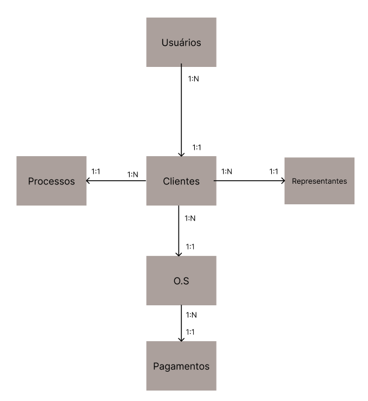

# SAMP

- Sistema automatizado de marcas e patentes

### Problema
O software antigo que era utilizado está muito caro e desatualizado. A ideia é construir um novo para se adequar melhor as necessidades do negócio atualmente.

### Entidades

Durante as conversas com a cliente, foram identificados as seguintes entidades:

- Usuários
- Clientes
- Representantes
- Ordens de servicos (O.S)
- Pagamentos
- Processos

Dentre elas, suas relacoes sáo da seguinte maneira:

O foco principal do desenvolvimento será o FRONT-END de primeiro passo, já que o design já está finalizado. Para isso, o primeiro passo será construir todo o sistema de autenticacão e login

Etapas a serem desenvolvidas:
  - Sistema de login e controle de autorizacões;
  - Visualizacão e gerenciamento dos clientes;
  - Visualizacão e gerenciamento dos representantes;
  - Visualizacão e gerenciamento das ordens de servico;
  - Visualizacão e gerenciamento dos processos;
