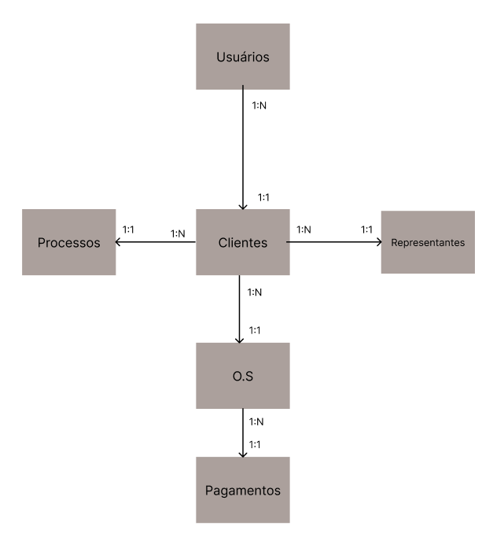

# SAMP

- Sistema automatizado de marcas e patentes

### Problema
O software antigo que era utilizado está muito caro e desatualizado. A ideia é construir um novo para se adequar melhor as necessidades do negócio atualmente.

### Entidades

Durante as conversas com a cliente, foram identificados as seguintes entidades:

- Usuários
- Clientes
- Representantes
- Ordens de servicos (O.S)
- Pagamentos
- Processos

Dentre elas, suas relacoes sáo da seguinte maneira:

O foco principal do desenvolvimento será o FRONT-END de primeiro passo, já que o design já está finalizado. Para isso, o primeiro passo será construir todo o sistema de autenticacão e login

Etapas a serem desenvolvidas:
  - Sistema de login e controle de autorizacões;
  - Visualizacão e gerenciamento dos clientes;
  - Visualizacão e gerenciamento dos representantes;
  - Visualizacão e gerenciamento das ordens de servico;
  - Visualizacão e gerenciamento dos processos;

## Representantes

### Dados da Entidade

Todo cliente possui seu representante, dentre ele, temos as seguintes propriedades a serem considerados:
- name          string
- nationality   string
- documentRG    string
- documentCPF   string
- titleJob      string
- roleJob       string

As informacões adicionais desse objeto, serão:
- id (GET, PATCH)
- createdAt (POST)
- updatedAt (PATCH)

### Mapeamento das rotas

> Listagem de todos os representantes de um cliente;
##### Route
- GET /client/:id/representatives?search=
##### Response
- [name, nationality, documentRG, documentCPF, titleJob, roleJob]
 

> Listagem de um representante correspondente deste cliente;
##### Route
- GET /client/:id/representative/:idRepresentative
##### Response
- {name, nationality, documentRG, documentCPF, titleJob, roleJob}
 

> Novo representante para esse cliente
##### Route
- POST /client/:id/representative
##### Response
- id

> Alteracão de um representante deste cliente
##### Route
- PATCH /client/:id/representative
##### Payload
- {name, nationality, documentRG, documentCPF, titleJob, roleJob}
##### Response
- id

> Alteracão do status de um representante
##### Route
- PATCH /client/:id/representative
##### Response
- id

### Branchs da feature

Separacão das branchs da feature a ser desenvolvida:

#### SMP-09: create server flow about representatives
- SMP-09-01: create flow to list representatives
- SMP-09-02: create flow to get a representatives
- SMP-09-03: create flow to add a representative
- SMP-09-04: create flow to update a representative
- SMP-09-05: create flow to change status of representative

####  SMP-10: create pages about representatives
- SMP-10-01: create page to list representatives
- SMP-10-02: add flow was created to list representatives
- SMP-10-03: add flow was created to change status of representative
- SMP-10-04: create page to manage a representatives
- SMP-10-05: add flow was created to add a representative
- SMP-10-06: add flow was created to update a representative

### Orders (3 days)
- Start date on 25/05

### Dados da Entidade

Ordens de serviço todos os usuários podem criar solicitaçoes correspondentes a uma empresa ou cliente. Onde posteriormente podem atrelar a um ou mais pagamentos atrelados a esse serviço.

- clientId      string
- title         string
- description   string
- obs           string
- data          string

#### SMP-11: create server flow about orders

- SMP-11-01: create route and test to add order
- SMP-11-02: create route and test to list orders
- SMP-11-03: create route and test to get order
- SMP-11-04: create route and test to update order
- SMP-11-05: create route and test to soft delete order

#### SMP-12: create pages about orders

- SMP-12-01: create page skeleton to list orders
- SMP-12-02: create integration to list orders
- SMP-12-03: create page skeleton to add order
- SMP-12-04: create integration to add order
- SMP-12-05: create page skeleton to update order
- SMP-12-06: create integration to update order
- SMP-12-07: create integration to delete order

### Payments (3 days)
- Start date on 02/06

Todas as ordens de serviço terão um ou mais pagamentos atrelados a ele. A ideia é construir a estrutura de centralização de informações de cada pedido de serviço acionado por determinada empresa.

#### SMP-13: create server flow about payments
- SMP-13-01: create route and test to add order
- SMP-13-02: create route and test to list orders
- SMP-13-03: create route and test to get order
- SMP-13-04: create route and test to update order
- SMP-13-05: create route and test to soft delete order

#### SMP-14: create pages about payments
- SMP-14-01: create page skeleton to list orders
- SMP-14-02: create integration to list orders
- SMP-14-03: create page skeleton to add order
- SMP-14-04: create integration to add order
- SMP-14-05: create page skeleton to update order
- SMP-14-06: create integration to update order
- SMP-14-07: create integration to delete order

### Process (3 days)

Essa é a sessão principal da aplicação. Onde basicamente serão atrelados os clientes de acordo com cada processo registrado por revista no INPI que gera a cada semana.

### Appointments (3 days)

Essa é a sessão correspondente a todos as agendas que um cliente possui com a equipe

### Fixes
- [x] Visualizacao do dashboard;
- [x] Visualizacao do modal de endereco no mobile;
- [x] Aumento do tempo da sessão ativa;

Process (926450913)
- N Processo
- Data (Data de deposito) - depositDate
- Data de concessao - ?
- Data de vencimento (Data de vencimento) - 
- Apresentacao
- Natureza
- Acompanhamento
- Titular
- Marca
- Classes (?)

- Acompanhamento ??? (Provavel que seja o historico lá)

- OrderType
- PaymentMethod
- 

- CHANGES FEATURE-22-fixes-some-features-to-the-last-version
- 10 - Uma formatacao única de datas;
- 9 - Os comprovantes do pagamento;
- 8 - Mudar a forma como a consulta do CEP é feita;
- 6 - Atualizacao de usuário nao desativa a senha de novo;
- 5- Verificar porque a pesquisa dos usuários não funciona;

#### Fixes
- Organizacao de imports
- Controle de estado no gerenciamento dos representantes.
- Controle de estado no gerenciamento das ordens de servico.
- Tratamento da O.S devido a troca do parametro de descripton para description.
- Verificar o porque dos pagamentos não cria (Era o méotdo de pagamento).

# Funcionalidades

## Cliente
- [OK] Adicionar novo cliente
- [OK] Pesquisa de um cliente
- [OK] Atualizar um cliente
- [OK] Visualizar um cliente
- [ ] "Deletar" um cliente

## Agenda
- [OK] Adicionar nova agenda
- [ ] Pesquisa de uma agenda
- [ ] Atualizar uma agenda
- [ ] Visualizar uma agenda
- [ ] "Deletar" uma agenda

## Representante
- [OK] Adicionar novo representante
- [OK] Pesquisa de um representante
- [OK] Atualizar um representante
- [OK] Visualizar um representante
- [OK] "Deletar" um representante

## O.S
- [OK] Adicionar nova Ordem de servico
- [OK] Pesquisa de uma Ordem de servico
- [OK] Atualizar uma Ordem de servico
- [OK] Visualizar uma Ordem de servico
- [ ] "Deletar" uma Ordem de servico
- [OK] Adicionar novo pagamento
- [ ] Atualizacao de uma parcela do pagamento
- [OK] Listagem de parcelas do pagamento

## Processos
- [OK] Importar/adicionar novo processo
- [OK] Pesquisa de um processo
- [OK] Atualizar um processo
- [OK] Visualizar um processo
- [OK] Importar/adicionar nova publicacao
- [OK] Pesquisa de uma publicacao
- [OK] Atualizar uma publicacao
- [OK] Visualizar uma publicacao
- [OK] "Deletar" uma publicacao

## Admin
- [OK] Adicionar novo usuário
- [?] Pesquisa de um usuário
- [OK] Atualizar um usuário
- [OK] Visualizar um usuário
- [OK] "Deletar" uma usuário
- [OK] Adicionar novo tipo de pagamento
- [OK] Pesquisa de um tipo de pagamento
- [OK] Atualizar um tipo de pagamento
- [OK] Visualizar um tipo de pagamento
- [OK] "Deletar" uma tipo de pagamento
- [OK] Adicionar novo tipo de ordem de servico
- [OK] Pesquisa de um tipo de ordem de servico
- [OK] Atualizar um tipo de ordem de servico
- [OK] Visualizar um tipo de ordem de servico
- [OK] "Deletar" uma tipo de ordem de servico

#### feature-22

- Possuimos tres situacoes

- O formato que manda para o prisma é:
  - DD/MM/YYYY (Podendo ser MM/DD/YYYY ou YYYY/MM/DD)

- O que vem do prisma é:
- DATA COMPLETA               APENAS DATA
- 2026-08-22T00:28:47.464Z ou 2026-08-22T00:00:00.000Z

- A ideia é criar um componente onde eu possa ter uma data DD/MM/YYYY ou DD/MM/YYYY HH:MM
- Assim quando a data tiver hora, converter para DD/MM/YYYY HH:MM
- Assim quando a data NAO tiver hora, converter para DD/MM/YYYY

- Na situacao que temos DD/MM/YYYY HH:M